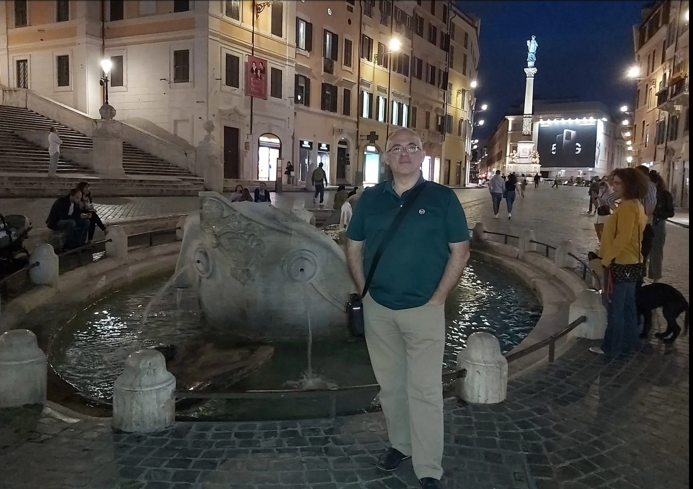

## About Me

  

Hi! I am an experienced IT professional with a University degree in Computer Science achieved at the University of Bari (Italy).
With more than 30 years of experience in the IT sector, I have had various roles, from Software Engineer and Team Leader to Business Analyst, Project Manager, and Data Analyst.
My career has taken me across some of Europe's most complex environments, collaborating with global companies and EU institutions.
I have worked on large-scale data migrations, cloud migrations, data portals, telco CRM and billing systems, document management and banking applications.
In my most recent experience, I have focused on translating ambiguous difficult stakeholder requirements into shipped, compliant solutions, this on time and on budget. I thrive where technology meets real-world impact.
I hold an IIBA®-AAC Agile Analysis Certification along with ITIL, Scrum, Six Sigma, and other certifications, with hands-on expertise in Agile/Scrum, BPMN/UML, data modelling, Power BI, Python, Oracle and AI-augmented analysis.
I operate comfortably in international contexts, with English (C1), native Italian, French (B1), and Polish (A2).
I'm equally at home wherever the next project takes me.
Outside of work, I recharge through travel, cooking, wine tasting, thermal wellness retreats, long walks in the mountains, and enjoying the sea.

## Areas of Focus

Requirements engineering, BPMN/UML modelling (ARIS, Camunda, Visio, Draw.io), REST API design
Serviceand task managements platforms such as Confluence, Jira, Service Now, IBM Maximo 
Agile Project Management across distributed, international and multicultural teams
AI-augmented Business Analysis and Digital Transformation
Cloud migration (AWS), data modelling, and Python and Power BI analytics
EU institutional IT governance and regulatory compliance
UX mockup design by Balsamiq

